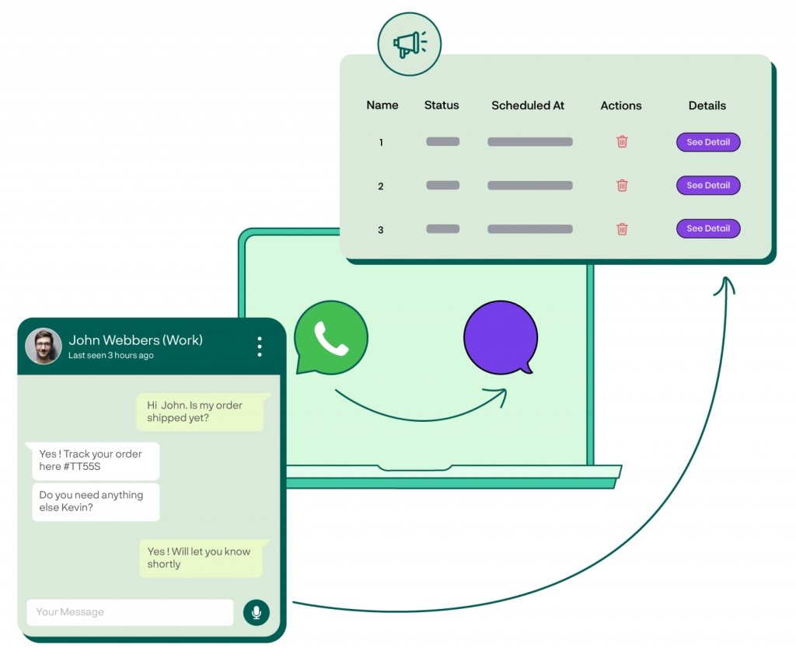

# Welcome to Chatobuy

<figure><figcaption></figcaption></figure>

## What is Chatobuy?

Great question by the way.

Well, Chatobuy is a multi-channel messaging platform where business owners like you can answer user queries coming from multiple platforms. Yes, you read that right!

You can answer to users sending messages from WhatsApp, Facebook, Instagram and more using this single platform -- Chatobuy. No need to access different messaging-platform accounts of your business platform. Do everything right from here.

Isn't it amazing, right?

Moreover, you can perform different actions that would allow you to provide great customer support to your users on the go. It's easy, powerful, and allows you to **send the right message to the right contact at the right time**.

Furthermore, you can invite your Team members to take part in it. That's even more awesome.

Let's find what you can enjoy while using the Chatobuy platform.

### Single Platform - Lots of Features

### Channels

Through Channels, you can connect multiple messaging platforms to Chatobuy. Thus, allowing you to answer queries of different users coming from different platforms. It simplifies how you connect with your customers by providing messaging options like Templates, Quick Replies, Interactive Messages and more.

<figure><figcaption></figcaption></figure>

### One-Inbox

With Chatobuy, you never have to log in to your different messaging platforms. The one-inbox will allow you to switch between Channels and see user queries right from RUM Work. Answer them, delete them, or pin them.

<figure><figcaption></figcaption></figure>

### Automation

Lower your burden of managing every user query. Set different Automation Workflows that perform different actions based on different Triggers and Conditions. Whether incoming messages or outgoing, you can set automated rules for numerous instances that happen between the Channels and Chatobuy.

<figure><figcaption></figcaption></figure>

### Run Campaigns

Want to send a single message to multiple customers or send multiple messages to a particular contact? Use Campaigns to broadcast messages of different kinds. Based on Channels, Time and more.

<figure><figcaption></figcaption></figure>

### Collaborate

You don't have to do everything on your own. Invite team members, and assign them different roles and duties to perform on Chatobuy from time to time. Whether for all Channels, Contacts or only specific, it's up to you.

<figure><figcaption></figcaption></figure>

### Integrate

Want to integrate 3rd party platforms to Chatobuy? No problem, the Integrations module will allow you to Call APIs, add Bots, capture Leads and more without any extra effort.

<figure><figcaption></figcaption></figure>

### And Much More!

The above is just a glimpse you can do on Chatobuy. There's more for you to utilize. For instance, create tickets, add events, build a knowledge base, answer FAQs, and much more!

Try it today and find the rest of the benefits yourself!!!


Next

