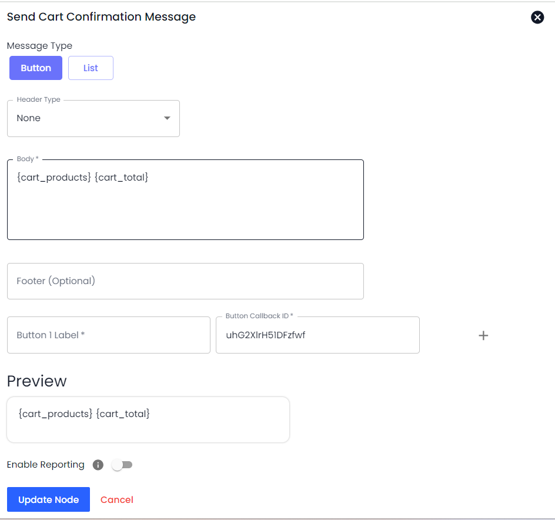

# Actions/Steps

Overview

Actions in an automation workflow are the Tasks that get executed when Trigger activates, and Trigger Condition(s) are fulfilled.

To add an action to an automation workflow, first, you need to select a [Trigger](https://github.com/rampwin/rampwin-gitbook-docs/blob/main/broken-reference/README.md), then the [Channel](https://github.com/rampwin/rampwin-gitbook-docs/blob/main/broken-reference/README.md) in which you want to trigger the automation. After that, add [Trigger Condition](https://github.com/rampwin/rampwin-gitbook-docs/blob/main/broken-reference/README.md)(s), and once you've added all, click the **Add Workflow Step** to access Action types and add them.

<figure><figcaption>
Workflow Steps/Actions
</figcaption></figure>

There are a total of 24 Actions for the Automated Workflow; based on those, you can run automated tasks at Chatobuy.

### Workflow Steps

The 24 Workflow Steps or Actions you can utilize at Chatobuy are,

#### Starting Point: Trigger Node

* **Define your trigger**: This could be an incoming message, a specific user action, a scheduled time, or an event from another system (e.g., new customer sign-up).

<figure><figcaption></figcaption></figure>

#### Workflow

* **Criteria Router**: Route the workflow based on specific criteria such as message content, user attributes, or other conditions.

<figure><figcaption></figcaption></figure>

* **Jump to Automation**: Jump to a specific automation flow based on criteria.

<figure><figcaption></figcaption></figure>

* **Delay Execution**: Introduce delays where necessary to control the timing of actions.

<figure><figcaption></figcaption></figure>

#### Messaging

* **Auto Reply Template Message**: Set up automated responses using predefined templates.
* If you've created a WhatsApp Template Message and want to send it automatically based on Trigger and its Condition, you can use the **Auto Reply Template Message** in the Workflow Step. This Automation only works for WhatsApp Official API Channels:
* Click on the Add Workflow Step **→** then select **Auto Reply Template Message** in the Action Type.
* After selecting the action type, select the template you've created before.
* Then, preview your message template and click **Add**.

<figure><figcaption></figcaption></figure>

* **Auto Reply Button/Option/Products**: Send automated replies that include buttons for options or product selections.

<figure><figcaption></figcaption></figure>

* **Auto Reply and Collect User Inputs**: Automate responses that also collect inputs from the user for further processing.
* If you want to ask users bot questions and want to save their responses in the contact fields, you can use this Workflow Step.

<figure><figcaption></figcaption></figure>

Under this, you've to define a question in the _Question_ field, and for the answer, you need to select a contact field from the _Save To Contact Attribute_ option.

<figure><figcaption></figcaption></figure>

There are a total of 11 Contact Attributes you can select from to save the answer.

<figure><figcaption></figcaption></figure>

For multiple questions, you can click the button **Add More Questions**, and once done, click **Add**.

#### `Customer` Interaction

* **Add To Drip Campaign**: Add users to a drip campaign for sequential automated messages.

<figure><figcaption></figcaption></figure>

* **Remove From Drip Campaign**: If the contact is in a Drip Campaign, and if you want to remove it from that based on the Trigger Condition(s) fulfillment, you can use this particular Automation Workflow Step.

<figure><figcaption></figcaption></figure>

Simply select the Drip Campaign from the list and click **Add**.

* **Add Contact List**: The automation Workflow can add the contact to a list under this Workflow Step when the automation trigger is activated.

<figure><figcaption></figcaption></figure>

* **Set Contact Attribute**:

If you like to save a message using the automation workflow, you can do that. The Action/Workflow Step provides you with the option to save a particular message to the Contact Attribute.

Update user attributes (e.g., set a tag, update a profile field).

<figure><figcaption></figcaption></figure>

* **Set Conversation Status**: Change the status of a conversation (e.g., open, closed, pending).

<figure><figcaption></figcaption></figure>

* **Mark Blacklisted**: Mark users as blacklisted to prevent further communication. If you want to avoid false Leads, Contact creation, or Incoming or Outgoing messages, you can put that on the blocklist using this particular Automation Workflow Step.

<figure><figcaption></figcaption></figure>

* **Assign To Team Member**: Whether you receive a new incoming message or send an outgoing, or perhaps a lead is generated. Therefore, based on the Trigger and its condition, if you want it to be reviewed or taken into notice by a Team Member, you can use this Automation Workflow Step.

<figure><figcaption></figcaption></figure>

There are two options it provides:

* Assign to Specific Team Member
* Assign One by One (Round Robin Method)
* **Unassign From Team**: Remove an assignment from a team member when necessary.

<figure><figcaption></figcaption></figure>

#### Security

* **Hide The File**: Secure sensitive files shared in the conversation.

<figure><figcaption></figcaption></figure>

* **Mark The Text Messages As Per Regex**: Use regex patterns to identify and mark specific text messages for follow-up or categorization.

<figure><figcaption></figcaption></figure>

#### Technical

* **Call REST API**: Integrate with external systems by calling REST APIs. Likewise sending information to the Rest API using the Push To CRM action type, you can also call/add the API of a 3rd party software or platform when needed using the automation for the particular Trigger.

<figure><figcaption>
Select <strong>Call REST API</strong> as the Action Type.
</figcaption></figure>

Then, according to your requirements and the platform's compatibility, add the REST API details. For instance,

* Type for URL as POST, GET, PUT, and DELETE.
* Input Header Key(s) and Value(s).
* Select Data Type as URL Encoded, JSON, or FORM.
* Then, add the JSON Data using the parameter fields, and once done, click **Add**.
* **Eval**: Execute custom scripts or code snippets for advanced processing.

<figure><figcaption></figcaption></figure>

#### Tagging

* **Add Tags**: To automatically assign tags to the contact, you can utilize this particular Automation Workflow Step.

<figure><figcaption></figcaption></figure>

Simply select the existing tags or define new ones and then click **Add**.

* **Remove Tags**: Create an automation step to remove tags from the contact.
* Select the tag(s) you want to remove and click **Add**.

<figure><figcaption></figcaption></figure>

#### Payment Processing

* **Send Payment Link**: Automate the sending of payment links to users.
* Based on your payment partner selected in the respective channel, you can create an automation rule to send a payment link when the trigger activates and all the conditions are met.

<figure><figcaption></figcaption></figure>

With the payment link, you can also add a custom message if needed. Explore the following settings to set up the payment link.

#### WhatsApp Chat Commerce

**Send Cart Confirmation Message**

* **Confirm orders**: Send messages to confirm cart contents and orders.

<figure><figcaption></figcaption></figure>

**Send WhatsApp Notification**

* **Alert and update**: Send notifications for order status, promotions, or updates.

<figure><figcaption></figcaption></figure>

#### 1. Auto Reply

Using this particular Workflow Step, define a message to send it as an auto-reply when trigger condition(s) is fulfilled.

<figure><figcaption>
Auto Replay Workflow Step
</figcaption></figure>

To use this Workflow step, simply add the text, use contact fields, insert any file you want to by clicking the Choose File button and once done, click **Add**.


When you select the Trigger type as New Facebook Lead Generated, then in the Auto Reply Step, you have to select a Channel as well.


#### 2. Auto Reply and Collect User Inputs

If you want to ask users bot questions and want to save their responses in the contact fields, you can use this Workflow Step.

<figure><figcaption></figcaption></figure>

Under this, you've to define a question in the _Question_ field, and for the answer, you need to select a contact field from _Save To Contact Attribute_ option.

<figure><figcaption></figcaption></figure>

There are a total of 11 Contact Attributes you can select from to save the answer.

<figure><figcaption>
Adding More Questions
</figcaption></figure>

For multiple questions, you can click the button **Add More Questions**, and once done, click **Add**.

#### 3. Add Contact to List

The Automation Workflow can add the contact to a list under this Workflow Step when the automation trigger is activated.

<figure><figcaption></figcaption></figure>

You can either create a new list or choose an existing one. Once the Trigger is activated and all the defined conditions meet, it will automatically add the contact to the selected list.

#### 4. Send Payment Link

Based on your payment partner selected in the respective channel, you can create an automation rule to send a payment link when the trigger activates and all the conditions meet.

<figure><figcaption></figcaption></figure>

With the payment link, you can also add a custom message if needed. Explore the following settings to set up the payment link.

#### 5. Save Message Text to Contact Attribute

If you like to save a message using the automation workflow, you can do that. The Action/Workflow Step provides you with the option to save a particular message to the Contact Attribute.

<figure><figcaption></figcaption></figure>

Select the **Save Message Text to Contact Attribute** in the Action Type.

<figure><figcaption></figcaption></figure>

Then, select a particular contact attribute in which you'd like to save the message. The automation workflow step provides you with the default attributes and custom ones you've created using the Custom Field.

#### 6. Auto Reply Template Message

If you've created a WhatsApp Template Message and want to send it automatically based on Trigger and its Condition, you can use the **Auto Reply Template Message** in the Workflow Step. This Automation only works for WhatsApp Official API Channels:

* [Cloud API](cloud-api.md).

Click on the Add Workflow Step **→** then select **Auto Reply Template Message** in the Action Type.

After selecting the action type, select the template you've created before.

In the Workflow Step / Actions section, select **Auto Reply Button/Options/Products** as the Action Type.

The Round Robin method will work per the configuration in the [Chat Settings](chat-settings.md).
