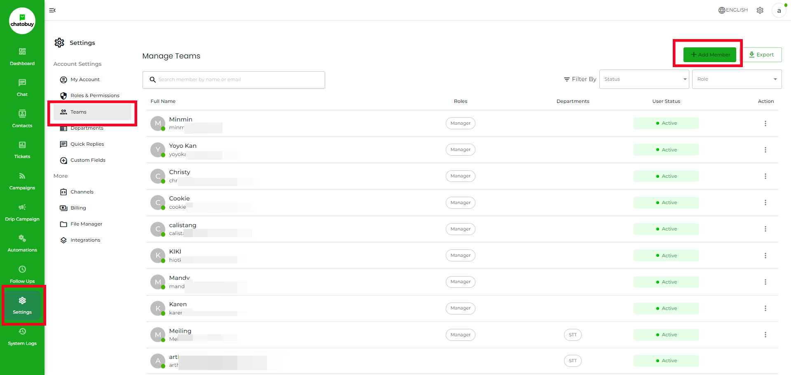
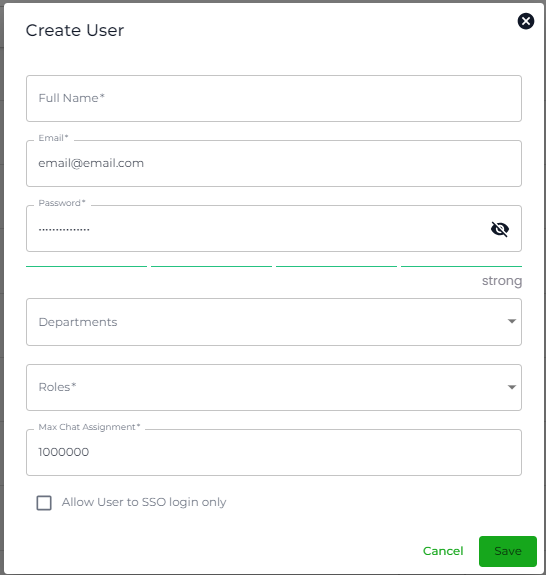
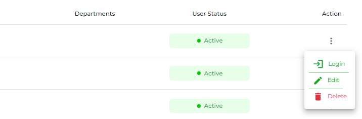
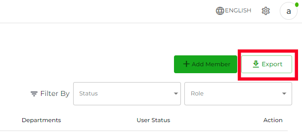
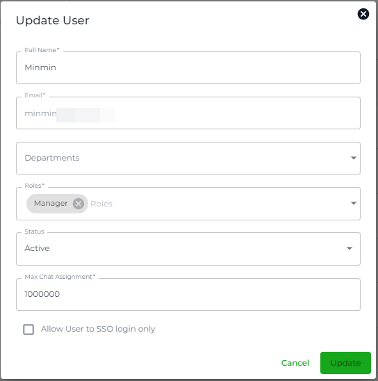
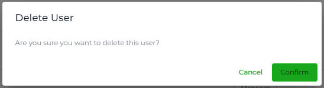

# Add Team Members

### Overview

Team setting allows you to create user accounts for your employers at Chatobuy. You can provide them with complete control or limited based on their position. Using their account, your team members can perform different tasks on assigned channels based on their [Department](department.md) and [User Role & Permission](roles-and-permissions.md).

This streamlines the process of managing [Channels](channels-overview.md) connections to the different chat platforms. Enabling you and your team to respond to users/customers in a timely manner and improve user-client relationships for the Business.

To access Team settings, go to **Settings** → then select the **Team** tab click **Create Team Member**.

<figure><figcaption></figcaption></figure>

On the Team tab, click **Create Team Member**.

<figure><figcaption></figcaption></figure>

This will open the create user modal with the following fields,

* Full Name
* Email
* Password
* Confirm Password
* Departments
* Roles
* Max Chat Assignment

Simply add the information, and once you've added all click **Save**.

As soon as you save the Team member it will appear in page like the above list.

### Activate/Deactivate

At Chatobuy, you get the option to activate/deactivate a Team member's account whenever needed. Whether for permanent/temporary reasons.

<figure><figcaption></figcaption></figure>

To toggle the switch or select the desired status from the Active and Inactive dropdown menu:

1. If using a switch, simply click on it to change the status from active to inactive or vice versa.

### Search a Team Member

To quickly find out a team member's account, you can use the Search option.

Simply enter the name of the member in the Search bar. And if only naming isn't working, then you narrow down the search using the Role option.

### Log in to a Team Member's Account

If, for some reason, you're required to access your team member's Chatobuy account, you can do that easily.

<figure><figcaption></figcaption></figure>

Simply head over to the Team member's account details, then click the Login button.

### Download Team

<figure><figcaption></figcaption></figure>

To download details of your Team member's account, click the **Export** button.

### Edit a Team Member

<figure><figcaption></figcaption></figure>

<figure><figcaption></figcaption></figure>

To edit team settings, follow these steps:

1. Go to "Settings" on the navigation menu.
2. Select "Team" from the options.
3. Locate the specific team member you want to edit.
4. Click on the action button.
5. Choose "Edit" from the dropdown menu.
6. Update the necessary information or settings.
7. Update Your Changes.

### Delete a Team Member

<figure><figcaption></figcaption></figure>

To delete a Team Member, follow these steps:

1. Go to "Settings" in the navigation menu.
2. Select "Team" from the options.
3. Locate the specific team member you want to delete.
4. Click on the action button next to their name.
5. Choose "Delete" from the dropdown menu.
6. Confirm the deletion if prompted.

Please note that deleting a team member will permanently remove them from your team. Make sure to proceed carefully. If you have any further questions, feel free to ask!

<figure><figcaption></figcaption></figure>

Then click the **Confirm** button to finalise deleting a team member.

### What's Next?

You've added your teammates, now you should know how you can respond to user messages. Let's explore that in the Chat module.
