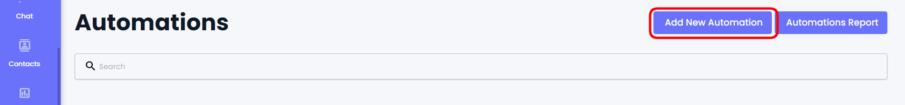
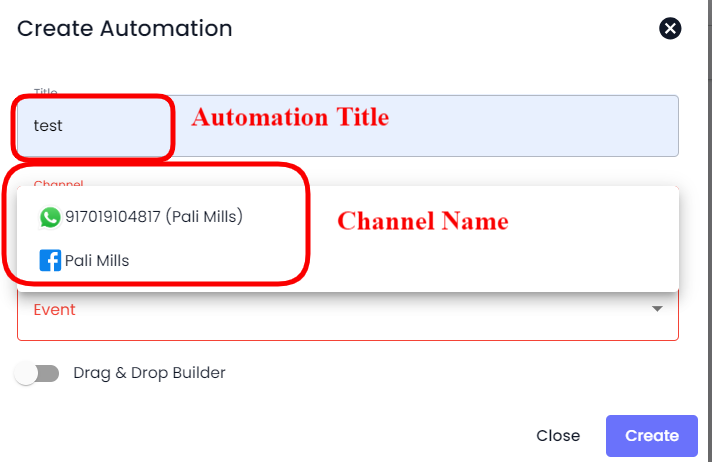
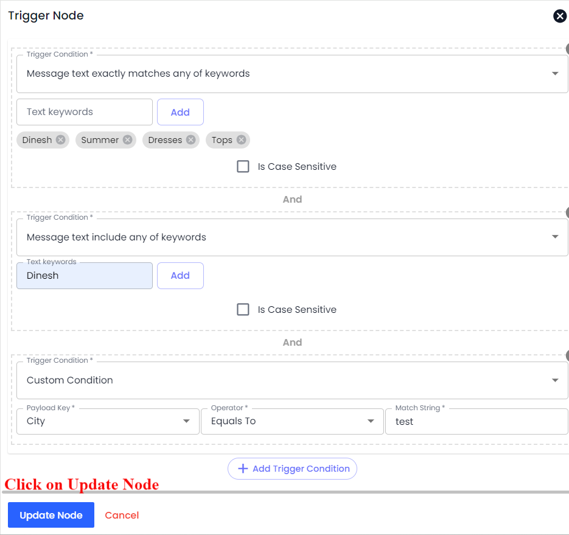
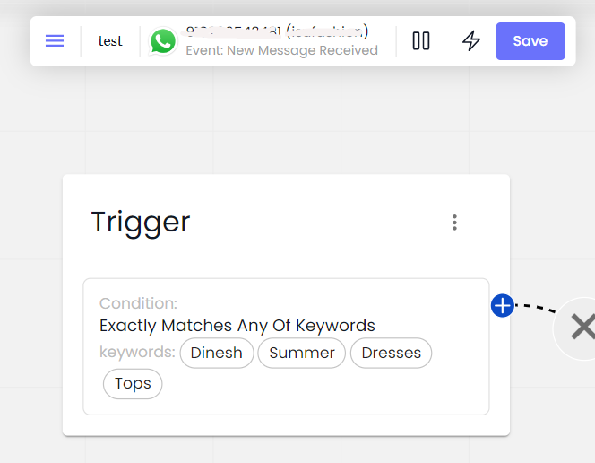
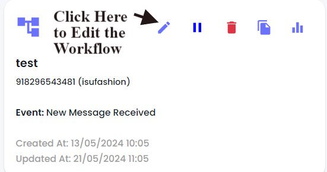

# Automation Workflows

### Overview

Using Automation Workflows, you can run automated Actions on Chatobuy based on **Trigger** and **Trigger Condition(s)**. For creating and running an automation workflow, it's necessary to select the Trigger (you can use only one trigger for single automation) and based on that; you need to choose condition(s) and define its values.

To access Automation Workflows, you can go to the **Automation** → **Automation** from your Dashboard.

<figure><figcaption></figcaption></figure>

Or, you can go to **→ Automation**.

### Creating a Workflow

To create an automation workflow, you need to click the **Create Automation Workflow** button.

<figure><figcaption></figcaption></figure>

This will open the Create Automation Workflow modal with the options as -

* Automation Name
* Channel / Service Integration (trigger dependent)
* Trigger Event
* Actions

<figure><figcaption></figcaption></figure>

Learn more about workflow options at -


[trigger.md](trigger.md)



[trigger-conditions.md](trigger-conditions.md)



[actions-steps.md](actions-steps.md)


#### Select Trigger

In the Create Automation Workflow modal, first, you need to define a name for the automation. Then, select a Channel from the available options.

<figure><figcaption></figcaption></figure>

After selecting the Channel, you need to select either a Trigger or Service Integration,

<figure><figcaption></figcaption></figure>

#### Select Trigger Condition

Based on your selected [Trigger](https://github.com/rampwin/rampwin-gitbook-docs/blob/main/broken-reference/README.md), you get the Trigger Conditions. Simply select the required condition.

<figure><figcaption></figcaption></figure>

Then, provide the text or keywords for the Match String or Text keywords field - except in the case of Received outside business hours, New Catalog Order Received, and Very first message or message after 24 hours of the last message.

<figure><figcaption></figcaption></figure>

Then check **Is Case Sensitive** if you want the Text or Keywords to exactly match.

<figure><figcaption></figcaption></figure>

If you want to use multiple conditions, click **Add More Condition**.

<figure><figcaption></figcaption></figure>

Once you've added the Trigger Condition(s), you can proceed to add the Workflow Steps.

#### Add Steps

To add Workflow Steps, click the **Add Workflow Step** to access Action types.

<figure><figcaption></figcaption></figure>

This will open the Workflow Steps modal with all the step types.

<figure><figcaption></figcaption></figure>

There are a total of 24 Workflow Steps you can select to assign them to an automation trigger. Simply select your Steps from the given list and configure them accordingly. To learn how each step works and what's the best way to configure them, visit [Steps](https://github.com/rampwin/rampwin-gitbook-docs/blob/main/broken-reference/README.md) documentation.

Once, you've saved the Step, it will appear in the Create Automation Workflow modal as the following.

<figure><figcaption></figcaption></figure>

To add more steps, you can simply click the Add Workflow Step button. Once you've added all the required steps, you can click Save to create your Automation Workflow.

<figure><figcaption></figcaption></figure>

It will appear in the Automation Workflows library.

<figure><figcaption></figcaption></figure>

### Editing a Workflow

To edit an Automation Workflow, click the Pen icon.

<figure><figcaption></figcaption></figure>

This will open the Update Automation Workflow modal. Here, you can only make changes to the Channel, Trigger Condition, and Steps.

<figure><figcaption></figcaption></figure>

<figure><figcaption></figcaption></figure>

You can add more conditions by clicking the Add More Condition button. Or you can change the current with another.

For Step(s) you can edit it by clicking the Pen icon on the right side. When you edit the step, you can change the value for the selected Step type. Or you can choose another Step by simply clicking the Action Type field.

<figure><figcaption></figcaption></figure>

Once the Step, click Update to make changes.

<figure><figcaption></figcaption></figure>

If you want to delete a step, simply click the Trash icon.

<figure><figcaption></figcaption></figure>

After making all the changes, to save the edited Automation Workflow, you need to click the **Update** button and Save.

### Deleting a Workflow

To delete an Automation Workflow, simply click the Trash icon next to the edit button.

<figure><figcaption></figcaption></figure>

This will remove the workflow completely.
