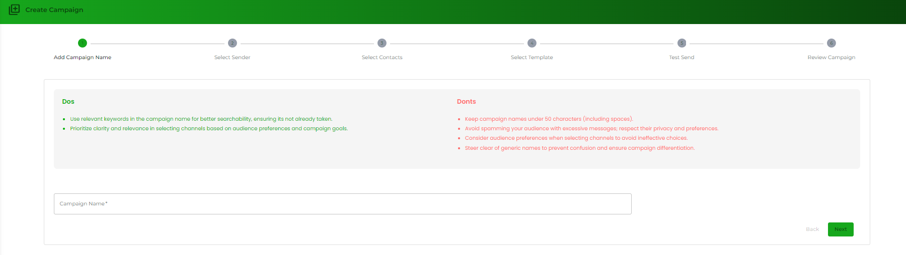
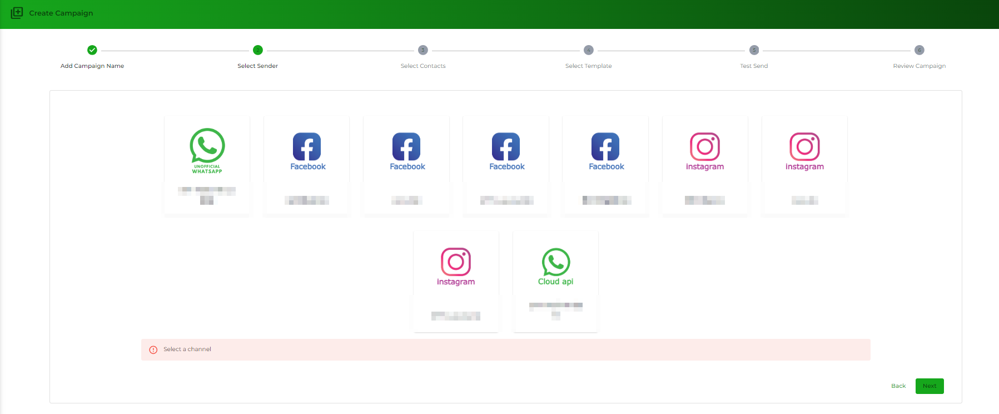
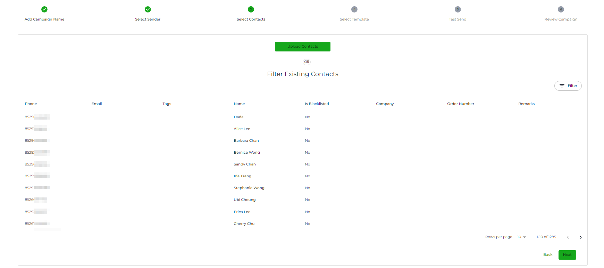
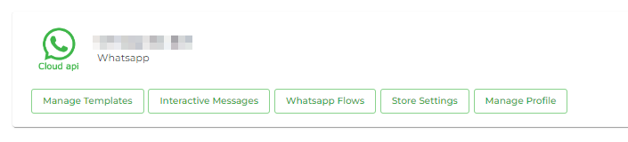
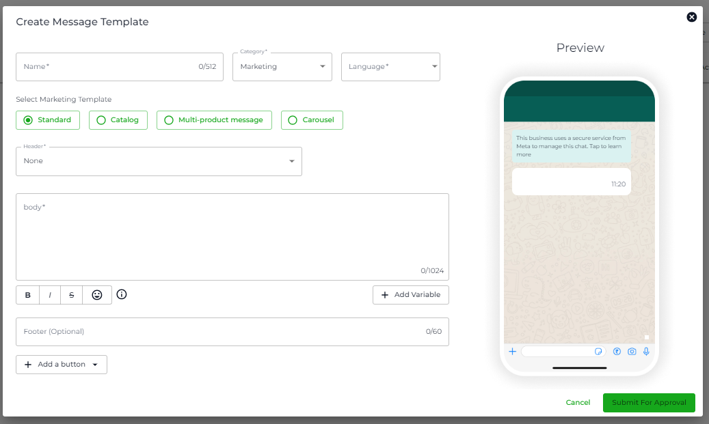

# Basic Campaigns

### Overview

In the Campaigns module, select the **Campaigns** option to access the Basic Campaigns dashboard.

Using Basic Campaigns, you can send a one-time message to single or multiple contacts. Also, the message type could be either a simple message or a [pre-approved message template](https://github.com/rampwin/rampwin-gitbook-docs/blob/main/broken-reference/README.md) based on the selected channels.


WhatsApp Business Platform has a Customer Service Window (24-hour) in which businesses can send both simple messages and [pre-approved templates](https://github.com/rampwin/rampwin-gitbook-docs/blob/main/broken-reference/README.md). Outside the customer service window, the business would require a message template.


### Create a Basic Campaign

To create a basic campaign, click the **Create Campaign** button in the campaigns window.

This will open a window where you'll find a timeline to create a campaign. The steps of the timeline are,

* Select Sender
* Select Contacts
* Select Template
* And Set Schedule

<figure><figcaption>
Create Campaign Window
</figcaption></figure>

The first step allows you to set the Campaign Name and select the Channel through which you want to send the campaign message. Simply enter the name, then select the channel, and after that, click **Next**.

### Select Sender

Next you will select whch channel to send the campaign.

<figure><figcaption></figcaption></figure>

### Select Contacts

Upon clicking next, you'll arrive at the second step of creating a campaign which is **Select Contacts**.

<figure><figcaption>
Select Contacts Step
</figcaption></figure>

Now to select the contacts, there are 2 ways.

1. By filtering the existing contacts.
2. By uploading the contacts.

#### Filtering Existing Contacts for the Campaign

Click the **Filter** button to access the filter options.

The filter options available are,

* **Columns**
* **Operator**
* **Value**

First, you need to select the column on the basis you want to filter the contacts. There are 10 options from which you can select the column.

<figure><figcaption></figcaption></figure>

After selecting the column, select the Operator that will verify the Value in the column. There are 9 operator types from which you can select one.

<figure><figcaption></figcaption></figure>

* IS - The Column and Value should exactly match to apply the filter.
* STARTSWITH - The value in the Column should start with the value in the Value field to run the filter.
* CONTAINS - If the value in the Column includes the value in the Value field, the filter will run.
* IS NOT - To apply the filter, the Column field should not match with the Value field.
* DOES NOT CONTAIN - To apply the filter, the Column field doesn't include the instances of the Value field.
* IN - The Tags be IN the Value field
* NOT IN - The Tags be NOT IN the Value field.
* MATCHES - The Channel Name should MATCH the Value.
* BETWEEN - The message should be Created or Updated BETWEEN the Date Range set in the Value.

Once selected the operator, enter the value or select the option available in the Value field. The value field based on Column provides you with different options that are,

* Tag list for the Tag column.
* User / Group for the Contact Type column.
* Channel names for the Channel Name column.
* Date Range (Today, Yesterday, This Week, This Month and Custom) for Created At and Updated At column.

After adding the values in the fields, click **Submit**.

As soon as you click the submit button, you'll find the contacts as the following,

If you want to add more filter groups, you can click the **Add Filter Group.**

Or, if you want to add another filter in the same group, click the Plus button 

To delete a Filter Group, you can click the **Delete Filter Group** button associated with that group.

And to delete a filter, you can simply click the Trash buttonassociated with the particular filter rule. Once you're satisfied with your filtered contacts, you can click the **Next** button.

#### Uploading Contacts for the Campaign

A modal will appear with the options to choose the Country Code, Add Tags, and Select the file. If the file already has a country code for the contacts, you can tick the **Phone Number have country code** checkbox.

Otherwise, first, select the country code, then add tags (if required), and add the contacts' file from your local system.

As you do that, you'll see your contact numbers and other details in the modal. Once you're satisfied, click **Next**.

On the next screen, ensure that all the information is assigned to the right column. If everything is correct, click **Next**.

It'll take a few moments to upload the contacts, and once the process is completed, you can click **Finish**.

As you finish, you'll find your contacts. Now, you can move to the 3rd step to create a campaign: **Select Template**.

### Select Template

Now, based on your selected Channel, you either get the option to send a template message. Or create a new one.  You must first have the template created&#x20;

To create a template, you can select **Manage Template** in your **Channel Settings.**

<figure><figcaption></figcaption></figure>

<figure><figcaption></figcaption></figure>

As per requirement, select the template or an existing message or create a new one. Once you're done, click **Next**.

### Set Schedule

On the **Set Schedule** window, you get to see all the information about your campaign. Plus, the option to send it right away or based on a schedule.

You can review the Campaign Name, Contacts, and Template as well as preview the content in the template. To send the Campaign the moment you've created it, you can click the **Send Now** button.

This will run your campaign immediately. Or, if you want to schedule it, you can enter the date and time in the _**Set Schedule**_ field.

First, select the date, then define the time and once both are defined, click **Ok**.

To run the campaign at different hours of the day, you can click the checkbox _Do you want to run this campaign in specific duration of day?_

Then input your Start and End Times for the broadcast. Once done will all the options of the schedule, whether sending it now, scheduling or broadcasting at specific hours, click **Finish**.

As you click the finish button, you'll find your campaign in the campaign list like the above.

### Search a Campaign

To refine or narrow down the campaign list, you can use the search option. Input the campaign related query in the **Search** bar, then from the **Date Range** field, apply a filter.

If there is any match, you'd see the campaign in the list.

### Campaign Details

To check how your campaign performed, click the **See Details** button.

This will open the Campaign Details window where you can view General and Message details.

In the General Details window, you can view the Total number of Messages Sent, Received, and Exchanged. You can also view the campaign Conversation Rate, Read, and Sent Status. Plus, check the details of when the Campaign was created, which Channel and Template were used, and who created it.

The Messages Details window allows seeing contact details as well as their status of reading the campaign. You can converse with the user directly from the campaigns by clicking theChat button. Furthermore, view the complete detail of the message for each contact by clicking theView button.

In addition to these, apply filters and download the details by clicking the **Filter** and **Download** buttons, respectively.


The filter can be applied in the same way as [selecting the contacts by filtering](basic-campaigns.md#filtering-existing-contacts-for-the-campaign) them for the campaign.


### Delete a Campaign

To delete a Campaign, simply click theTrash icon under the Action column of the campaign.

Then click the **Confirm** button to finalise the delete.
