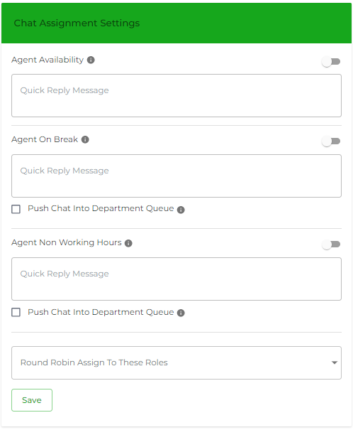

# Chat Assignment Settings

<figure><figcaption></figcaption></figure>

Chat Assignment Settings" typically refers to the configuration options available for managing how incoming chats or messages are assigned to agents or representatives within a business or customer support system. Here's a general guide on how you might access and configure these settings:

1. **Agent Availability**: Configure settings related to agent availability, such as specifying working hours or setting up automatic routing during peak times.
2. The "Agent On Break" feature typically allows agents or representatives in a customer support or chat system to indicate when they are temporarily unavailable to handle incoming chats or calls. Here's how this feature generally works and how it can be configured:
3. **Non-Working Hours Status**: During times when agents are not scheduled to work, they can set their status as "Non-Working Hours" or "Offline". This indicates to the system and customers that they are unavailable to handle inquiries.

