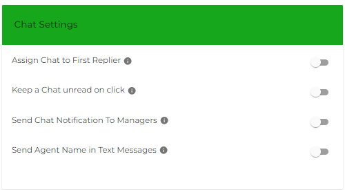

# Chat Settings

Chat Settings of [My Account](my-account.md) lets you activate the following options,

<figure><figcaption></figcaption></figure>

* Assign Chat to First Replier
* Keep a Chat unread on click
* Send Chat Notifications to the Manager
* Send Agent Name in Text Messages
