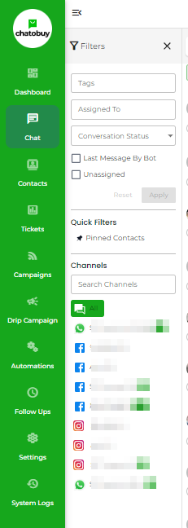
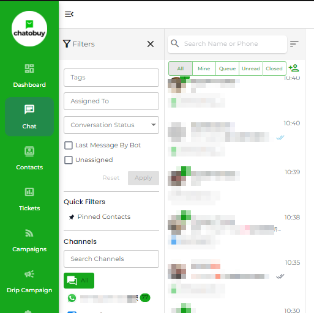

# Chat

### Overview

The Chat module at Chatobuy allows viewing user/customer messages sent or received on different chat platforms. Plus, it enables you to communicate with your customers on different channels and provide top-notch customer service without opening too many platforms or inboxes.

Through Chat, you can respond to queries coming from WhatsApp, Facebook, Instagram, Telegram, LINE, and WeChat.

Although upon login to Chatobuy, by default, you'll be on the Chat module interface. But still, to access the Chat module, click the Chat option in the sidebar.

The Chat module has different sections that allow you to efficiently manage and perform several actions on conversations.

### Search Options

Using this particular option in the Chat module, you can search, filter, and sort conversations.

### Channel Selector

<figure><figcaption>
Chat Channel Selector
</figcaption></figure>

Switch between Chatobuy channels to view conversations and communicate with users messaging from different chat platforms.

### Conversation Tray

<figure><figcaption></figcaption></figure>

Select conversations to communicate with users.

### Contact Info

Edit contact information; create ticket and more.

### Chat Area

Simply communicate with users using different message types and more.

### Chat More Options

Change conversation Open status, read status, assign bot, pin chat, and more.
