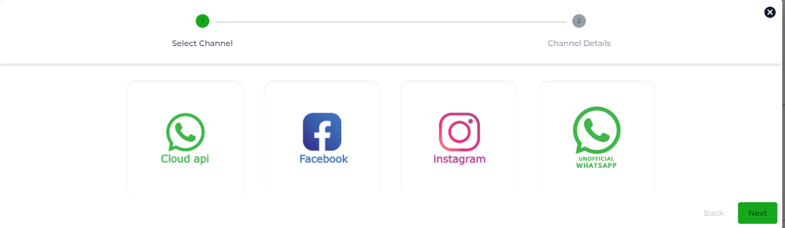

# Connecting to a Channel

Chatobuy simplifies chat commerce through Channels that enable you to connect to different Chat Platforms, for example, WhatsApp, Facebook, Instagram, Telegram, etc. Follow this guide to learn how Channels work and can connect with a particular chat platform.

### Step 1 - Login to the Chatobuy Dashboard

Use your login ID and Password to access your Dashboard.

### Step 2 - Access Channels

Inside the Dashboard, go to the left sidebar and select _Channels_.

### Step 3 - Create a Channel

Upon selecting the Channels, a new window will open with 4 Channel options.

* Cloud API
* Facebook
* Instagram
* Unofficial Whatsapp

To create a channel, simply go to the channel option and click _Configure_. It will open a popup where you need to enter the details to complete the process.


To learn how to get the required details, you can explore individual guides of each channel.


If you have already created a channel before, the Channels window then shows a channel list allowing you to apply changes to existing channels easily.

<figure><figcaption>
Channels List
</figcaption></figure>

To create a new channel, simply click the _Create Channel_ button. A popup will appear asking which Channel connection you want to create.

<figure><figcaption>
Channel Options Available at Chatobuy
</figcaption></figure>

Select the required Channel and click _Next_. Then, follow the next step to complete the connection. Check out other user guides to learn how you can create a channel for a specific chat platform option available at Chatobuy&#x20;

### What's Next?

As you've learned how you can create and connect a channel, you can now proceed with creating different channels or adding team members to your Chatobuy account.
