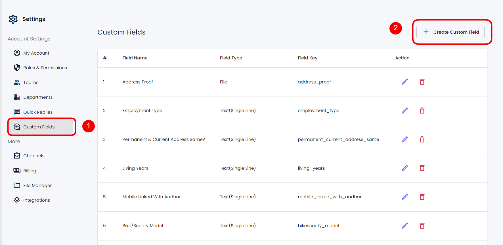

# Custom Fields

### Overview

Custom Fields are used to save or obtain additional information about your customers using different Field Types. You can access that information using the Contacts module or while interacting with them using Chat.

To open the Custom Fields option window, go to Contacts → Custom Fields from your Dashboard.

<figure><figcaption></figcaption></figure>

Or you can select Settings, then choose the Custom Fields tab.

<figure><figcaption></figcaption></figure>

In both cases, you'll be able to access the Custom Fields options.

### Create a Custom Field

To create a Custom Field, you need to click the Create Custom Field button.

<figure><figcaption></figcaption></figure>

This will bring the Create Custom Field modal, where you get the following options:

<figure><figcaption></figcaption></figure>

* **Field Name** - Define the name of your custom field.
* **Field Type** - Select a custom field type from 6 different types that are,
  * Text(Single Line)
  * Text(Multi-Line)
  * Email
  * Number
  * Date
  * Date Time
  * File
  * Object
* **Priority** - To assign importance level to regard the field as more important than other custom fields. Numeric 1 is regarded as the top priority.
* **Search Allowed** - To search contacts based on Custom Field.
* **Show On Contacts Grid** - To showcase custom field details in the contacts module.

<figure><figcaption></figcaption></figure>

* **Is Required** - When creating the contact, adding value(s) to this field is necessary.

Now, to create the custom field, first, input the Field Name, then select a Field Type.

<figure><figcaption></figcaption></figure>

After selecting the field type, define Priority and check the tick box next to Search Allowed, Show On Contacts Grid, and Is Required if you want to apply those conditions on the field.

<figure><figcaption></figcaption></figure>

Once utilized all the options, click **Save** to create the Custom Field.

### Edit a Custom Field

You'll find created custom fields in the Custom Fields window, Contacts → Custom Fields, like the following.

<figure><figcaption></figcaption></figure>

To edit a custom field, click on the Pen/Edit Icon.

<figure><figcaption></figcaption></figure>

Simply make the changes, and once edited, click **Update**.

### Delete a Custom Field

<figure><figcaption></figcaption></figure>

Locate your custom field by going to the Contacts → Custom Fields.

<figure><figcaption></figcaption></figure>

Then, click on the Trash icon and further click **Confirm**.

### Use

To utilize a particular Custom Field, you can access the Contacts module and, from there, edit the contact. Then, scroll down to find the custom field(s).

<figure><figcaption></figcaption></figure>

Once added or edited the information, you can click **Save**.

#### Access Custom Fields Using Chat

Another method to access custom fields is when you're chatting with the contact.

<figure><figcaption></figcaption></figure>

Click on the contact's name, then click the Edit icon. This will open the Edit Contact modal. Scroll down to find the custom fields to add the information or edit it
