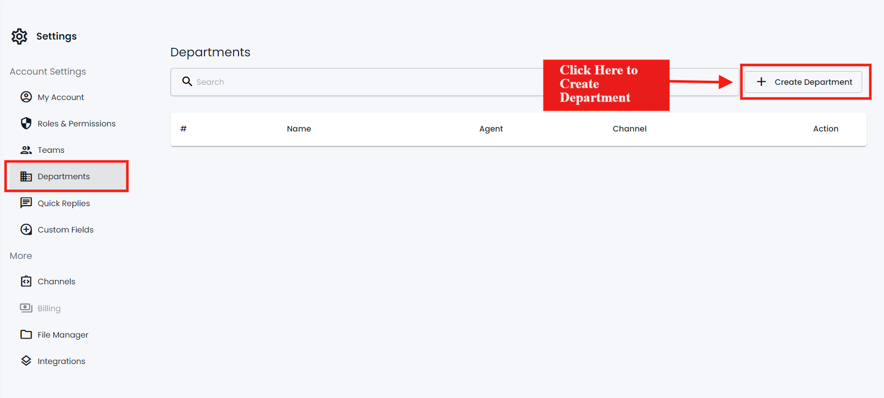
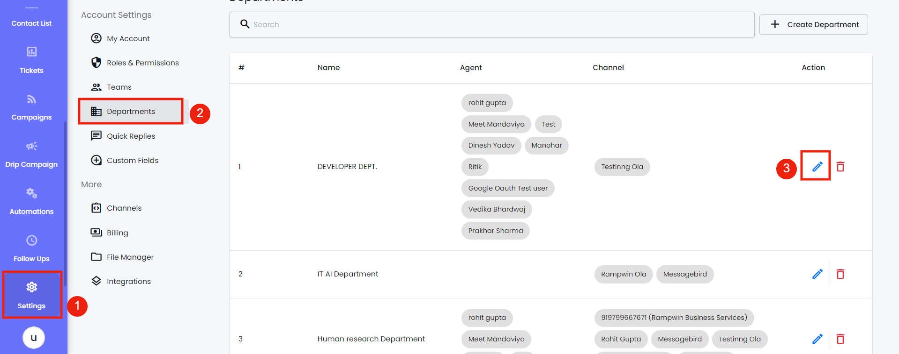
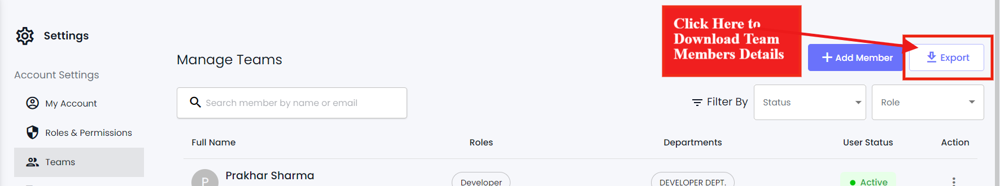

# Department

### Overview

Using the Department setting, you can create new Departments; Edit and Delete them. Using a particular department, you can sort your [Team](https://github.com/rampwin/rampwin-gitbook-docs/blob/main/broken-reference/README.md) members and provide them with access to manage specific channel(s).

To open the Department setting, go to **Settings** and then select the **Department** tab.

<figure><figcaption></figcaption></figure>

Create a Department

On the Department window, click **Create Department**.

<figure><figcaption></figcaption></figure>

Then, input Department; select Channels and Agents( Team members) if any. Once done, click **Save**.

<figure><figcaption></figcaption></figure>

### Edit a Department

<figure><figcaption></figcaption></figure>

Open **Settings** → **Department** → and click on the Edit icon.

<figure><figcaption></figcaption></figure>

Then make appropriate changes and click **Update** to save changes.

### Delete a Department

<figure><figcaption></figcaption></figure>

Click the Trashicon next to the edit button.

<figure><figcaption></figcaption></figure>

Then click **Confirm** to finalize deleting.

### Download Team

<figure><figcaption></figcaption></figure>

To download details of your Team member's account, click the **Download** button.

### Edit a Team Member

<figure><figcaption></figcaption></figure>

Open **Settings** → **Team** → and click on the Edit icon.

<figure><figcaption></figcaption></figure>

Then make appropriate changes to the Department, Roles and Status. Once edited, click **Update** to save changes.

### Delete a Team Member

<figure><figcaption></figcaption></figure>

Open **Settings** → **Team** → and click on the Trash icon

<figure><figcaption></figcaption></figure>

### What's Next?

You've added your teammates, now you should know how you can respond to user messages. Let's explore that in the Chat module.
