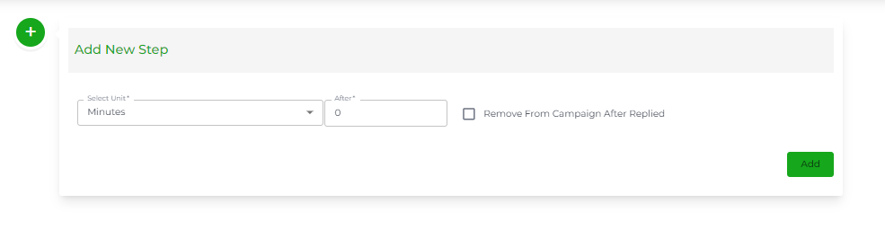
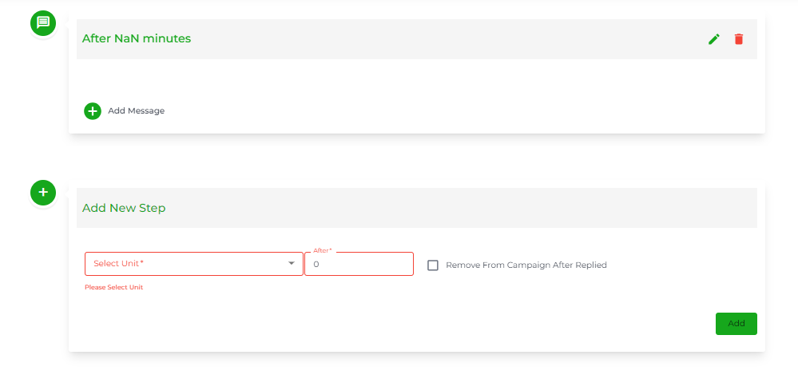
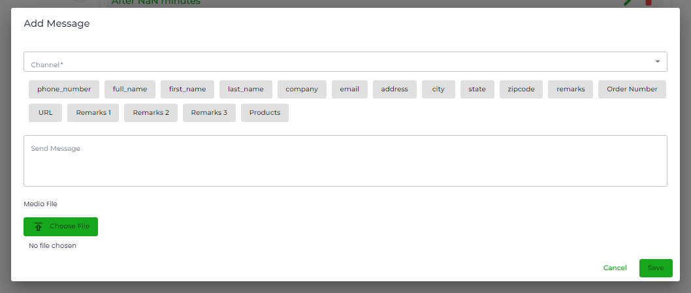

# Drip Campaigns

### Overview

To access Drip Campaigns, go to **Campaigns** → **Drip Campaigns**.

The Drip Campaigns work around a Step-by-Step message broadcast system. Each step includes single or multiple messages of the same or different channels. To get the messages broadcasted of each step, the first step needs to be completed. And after that, the following steps will be executed based on the condition.

<figure><figcaption></figcaption></figure>

Using Drip Campaigns, you can send multiple messages to single or multiple contacts. The message type could be a simple message, List/Button/Options/Product Messages, or a pre-approved message template based on the selected channels.


WhatsApp Business Platform has a Customer Service Window (24-hour) in which businesses can send simple messages, List/Button/Options/Product Messages, and [pre-approved templates](https://github.com/rampwin/rampwin-gitbook-docs/blob/main/broken-reference/README.md). Outside the customer service window, the business would require a message template.


### Create a Drip Campaign

<figure><figcaption>
Accessing Drip Campaign Builder
</figcaption></figure>

In the Drip Campaigns window, click the **Create Drip Campaign** button. This will open the Drip Campaign Builder, where you get the option to define the Campaign Name and add the Step.

Simply define the Campaign Name.

### Add a Step

After assigning the campaign name, click **Add a step** button to create a step for the Drip Campaign.

<figure><figcaption></figcaption></figure>

As you do that, an Add Step modal will popup with the options to

* Remove the step from the campaign after replied.
* Add value for the unit. (Run After)
* And select the unit. (Select Unit)

<figure><figcaption></figcaption></figure>

At Chatobuy, you get 4 units to run a step in a Drip Campaign. The units are,

* **Immediately** - Execute the step as soon as the contact(s) is assigned.
* **Minutes** - Execute the step after mentioned minutes defined in the Run After Field.
* **Hours** - Execute the step after mentioned hours defined in the Run After Field.
* **Days** - Execute the step after mentioned days defined in the Run After Field.

To add the step,

1. Check _Remove From Campaign After Replied_, if you don't want the step once it's executed.
2. Then, set value in the Run After field.
3. Afterward, select the unit in the Select Unit field to validate the Run After field's value.
4. And once done with the above, click **Add**.

And you'll find the step like the above.

### Add Message

After adding a step, you need to add a message(s) to it. And for that, click the **Add Message** button in the step.

<figure><figcaption></figcaption></figure>

As you do that, the Add Message modal will popup. In that, you can select your Channel and based on that, input your message.

If you select the channel created with Cloud API, you get the option to **Select Message Type**.

<figure><figcaption></figcaption></figure>

The available, message types are

* Text Message (simple message the same as you can send in the Maytapi for the campaign.)
* Buttons/Options/Products Message
* Template Message


You can only use Text Message and Buttons/Options/Products Message in the Drip Campaign when it's within the 24-hour customer service window. Otherwise, choose Template Message.


Simply select a message type and continue with it.

#### Buttons/Options/Products Message for Drip Campaign's Step

When you select the Buttons/Options/Products Message message type, you get the following options and fields.

You can start creating a new Buttons/Options/Product Message.

Or you can select an already created Buttons/Options/Product Message you created before while configuring the channel.

<figure><figcaption></figcaption></figure>

Once you select the Buttons/Options/Products Message, you can see all the content and details of it.

Once satisfied with the message content, click **Save**.

#### Template Message for Drip Campaign's Step

When you select the Template Message as the Message Type, you get the option to select a template you've created before.


Refer to [WhatsApp Message Templates](whatsapp-message-templates.md) Docs to learn more about creating a Template Message.


Select the template, then review its content and if everything's correct, click **Save**. Your added message will appear in the step as the following.

Likewise, you can add another message to the step. And for another step, simply click the **Add a step** button and follow the same procedure mentioned above.

After adding all the steps and their messages, click the **Save** button to create the Drip Campaign.

Once it's created, you'll find it in the Drip Campaigns list just like the above screenshot.

### Use a Drip Campaign

You've created a Drip Campaign; however, to run it, you need to assign contacts to it. And to do that, there are 2 ways.

* [Using the Chat](drip-campaigns.md#assigning-contacts-to-a-drip-campaign-using-chat). (For single contact assign)
* Or [Through Contacts](drip-campaigns.md#assigning-contacts-to-a-drip-campaign-using-contacts). (For bulk contacts assign)

Let's look at both ways one by one.

### Assigning Contacts to a Drip Campaign (Using Chat)

On your Chat screen, make sure you're on the right channel that you've used to create the campaign. If not, then click theMenu button next to the channel name and select the appropriate channel.

After selecting the channel, locate and select the chat of the contact you want to assign to the Drip Campaign. You can use the chat search option to speed the process.

Once opened the conversation, click theOptions button in the top right corner.

Then select **Add to Drip Campaign** from the available options.

A modal will appear, in that select the campaign to which you want to assign that particular contact.

Once selected, click **Add**. That's it; you've added a contact to the Drip Campaign. If the campaign's step is set to immediately, then it will be executed the moment you add the contact.

### Assigning Contacts to a Drip Campaign (Using Contacts)

In addition to the Chat, you can use [Contacts](https://github.com/rampwin/rampwin-gitbook-docs/blob/main/broken-reference/README.md) to add single or multiple contacts to a Drip Campaign.

To do that, first, go to **Contacts** → and select **Contacts**.

Then, select the contacts you want to add to the Drip Campaign. Once selected, click theMenu button next to bulk select, and then click **Add to Drip Campaign**.

Select the campaign to which you want to add the contacts and then click **Save**.

That's it, you've added the contacts to a Drip Campaign. If the campaign's step is set to immediately, then it will be executed the moment you add the contact.

### Campaign Details

To check how your campaign performed, click the **See Details** button.

This will open the Campaign Details window where you can view General, Message, and Contact details.

In the General Details window, you can view the Total number of Messages Sent, Received, and Exchanged. You can also view the campaign Conversation Rate, Read, and Sent Status of each step's messages.

Plus, check the details of when the Campaign was created, and who created it.

#### Messages Detail

The Messages Details window allows seeing contact details as well as their status of reading the campaign. You can converse with the user directly from the campaigns by clicking theChat button. Furthermore, view the complete detail of the message for each contact by clicking theView button.

In addition to these, apply filters and download the details by clicking the **Filter** and **Download** buttons, respectively. When you click the Filter button, you get the following options to filter our messages details,

* **Columns**
* **Operator**
* **Value**

First, you need to select the column on the basis you want to filter the contacts. There are 10 options from which you can select the column.

<figure><figcaption></figcaption></figure>

After selecting the column, select the Operator that will verify the Value in the column. There are 6 operator types from which you can select one.

<figure><figcaption></figcaption></figure>

* IS - The Column and Value should exactly match to apply the filter.
* STARTSWITH - The value in the Column should start with the value in the Value field to run the filter.
* CONTAINS - If the value in the Column includes the value in the Value field, the filter will run.
* IN - The Read and Send Status should be IN the Value.
* MATCHES - The Channel Name should Match the Value.
* BETWEEN - The message should be Created Between the Date Range set in the Value.

Once selected the operator, enter the value or select the option available in the Value field. The value field, based on the selected Column, provides you with different options that are,

* I/O for the Direction column, indicating Incoming and Outgoing messages.
* FAILED, SENT, NOT\_ON\_WHATSAPP, PENDING options for the Send Status column.
* TRIGGERED, DELIVERED, and VIEWED options for the Read Status column.
* Channel names for the Channel Name column.
* Date Range (Today, Yesterday, This Week, This Month and Custom) for Created At column.

After adding the values in the fields, click **Submit**.

If you want to add another filter, click the Plus button 

To remove a filter, you can simply click the ✖ Remove button associated with the filter. And to delete all the filter rules, you can simply click theTrash button.

#### Contacts Detail

The Contacts detail window lets you view contacts added to the campaign. Plus, you can apply Filter, Download Contacts, or even remove a Contact(s) from the campaign.

To remove a single contact, simply click the  Trash button.

Or, to remove multiple contacts, first, select them, then click the Options button next to Bulk select and click _Remove From Drip Campaign_**.** Then click the **Confirm** button to finalise removal.

The Filters can be applied in the same way as Message Details; however, here, you only get 3 columns,

<figure><figcaption></figcaption></figure>

* Phone.
* Email.
* And Name.

And based on these columns, you get 3 Operators,

<figure><figcaption></figcaption></figure>

* IS
* STARTSWITH
* CONTAINS

First, select the Column, then Operator, provide the Value and click **Submit**.

### Edit a Drip Campaign

To edit a Drip Campaign, click theEdit button under the Actions tab of the campaign.

### Edit/Delete a Step/Message

First, [Edit the Campaign](drip-campaigns.md#edit-a-drip-campaign).

Then, to edit or remove a step, click theOptions button. Then from the available options, either select

<figure><figcaption></figcaption></figure>

* Remove Step
* Or Edit Step

Based on your selection, continue with the process

To edit or remove a message, click theOptions button associated with the message. Then from the available options, either select

<figure><figcaption></figcaption></figure>

* Remove Message
* Or Edit Message

Based on your selection, continue with the process. Once done with the edits, click **Update**.

### Delete a Drip Campaign

Click theTrash button under Actions tab.

Then click the **Confirm** button to finalise the delete.

### Duplicate a Campaign

If you'd like to duplicate a campaign, clickDuplicate button.

And as you do that, you'll be directed to the campaign builder with duplicate Steps and their messages. Now, follow the steps to add more steps, messages; edit or delete them. Then Save the campaign and assign contacts to finally run the Drip Campaign.
