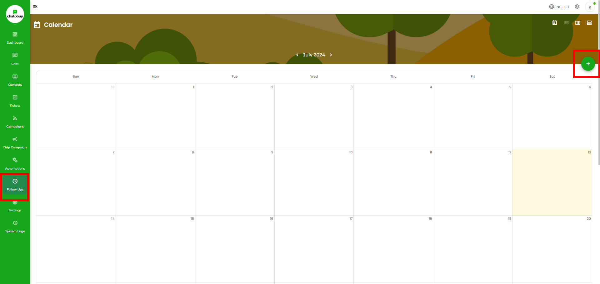
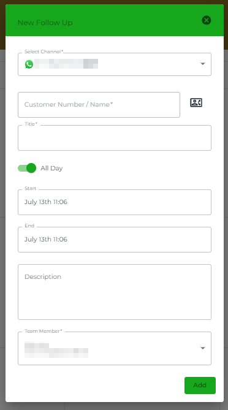

# Follow Ups

Using the Follow Ups module, you can remind yourself or one of your teammates about the last conversation you had with the client/customer/user, and based on that, go for a follow-up.

<figure><figcaption></figcaption></figure>

From your Dashboard, go to the left sidebar, and select **Follow Ups**.

As you access the Follow Ups, you'd see a calendar where all the follows will be listed. From the calendar view, you get the option to change months, calendar view; and create a follow up.

To change months, click the slider arrows next to the month's name.

To change the calendar view, use the options in the top right corner.

*  = Back to the current date.
*  = Month view.
*  = Week view.
*  = Day view.

To create a new follow up, click the  Plus Icon button.

<figure><figcaption></figcaption></figure>

This will open the New Follow Up modal, where add the details as required, and once done, click **Add**.

You'll find the created follow up in the calendar like the above.


You can also create a follow up using the [Chat module](broken-reference).


### Edit or Delete a Follow Up

If you want to make changes to a follow up, simply click it in the calendar, then apply changes and click **Save**.

The delete option is also found next to the Save button. To remove a follow up, tap the Trash Icon button and then **Confirm.**
