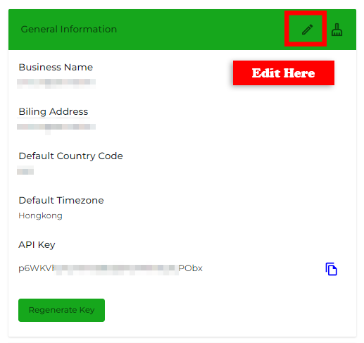
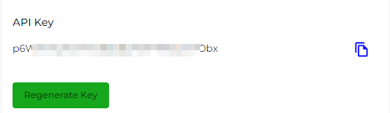
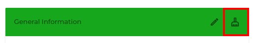
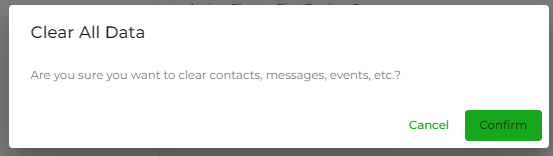

# General

Using the **General Information** option of the [My Account](https://github.com/rampwin/rampwin-gitbook-docs/blob/main/broken-reference/README.md) settings, you can manage the following details,

* Business Name
* Billing Address
* Default Country Code
* Default Timezone
* API Key

To add the information or make changes to it, click the Edit icon.

<figure><figcaption></figcaption></figure>

Then, you get the fields to add the information or make changes. Simply input the Business Name first, then the Billing Address. Choose Default Country Code and Time Zone. Once you're done editing or adding the info, click **Update** to save changes.

If you're required to access the API Key of your Chatobuy business account, you can obtain that by clicking the Copy button.

<figure><figcaption></figcaption></figure>

And if, in any scenario, you need to change the API, then you can do that by clicking the **Regenerate Key** button.

### Reset Data

If you're required to delete all of your data from Chatobuy, for example, contacts, chat, campaigns and more, then you can do that by clicking the Clean icon.

<figure><figcaption></figcaption></figure>

It will open the Clear All Data confirmation popup.

<figure><figcaption></figcaption></figure>

To finalise cleaning, click **Confirm**. And all of your data will be removed safely.
