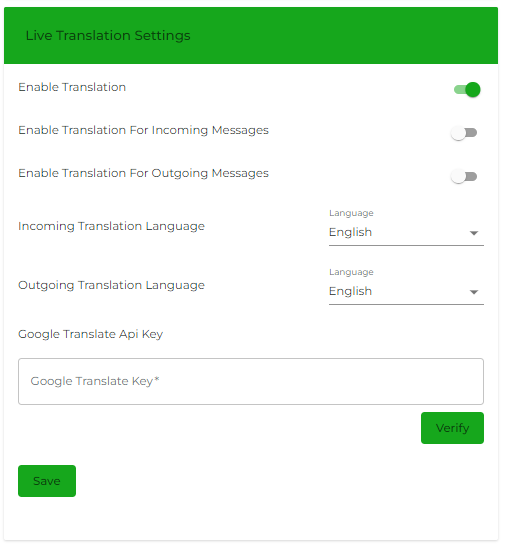

# Live Translation Settings

<figure><figcaption></figcaption></figure>

Look for an option to enable live or real-time translation. This setting ensures that transactions occur as conversations happen in real-time.

This also requires Google Translate API Key which you may obtain from your Google Console. [Click here for more info.](https://cloud.google.com/translate?utm\_source=google\&utm\_medium=cpc\&utm\_campaign=na-CA-all-en-dr-bkws-all-all-trial-e-dr-1707554\&utm\_content=text-ad-none-any-DEV\_c-CRE\_665641361994-ADGP\_Hybrid+%7C+BKWS+-+MIX+%7C+Txt-AI+and+Machine+Learning-Translation-KWID\_43700077212831098-kwd-14329410560\&utm\_term=KW\_google%20translate%20api-ST\_google+translate+api\&gad\_source=1\&gclid=CjwKCAjwqMO0BhA8EiwAFTLgIPsSZTgRYVOKTQZD\_NLSXkZjmL8FbJgIHmKFy5AJcHcYgeecfY7xPhoCCtUQAvD\_BwE\&gclsrc=aw.ds)
