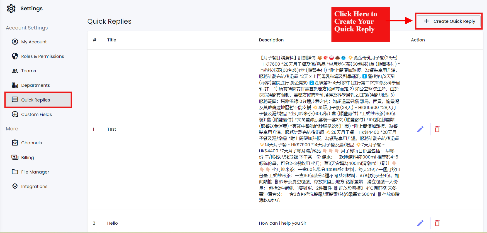
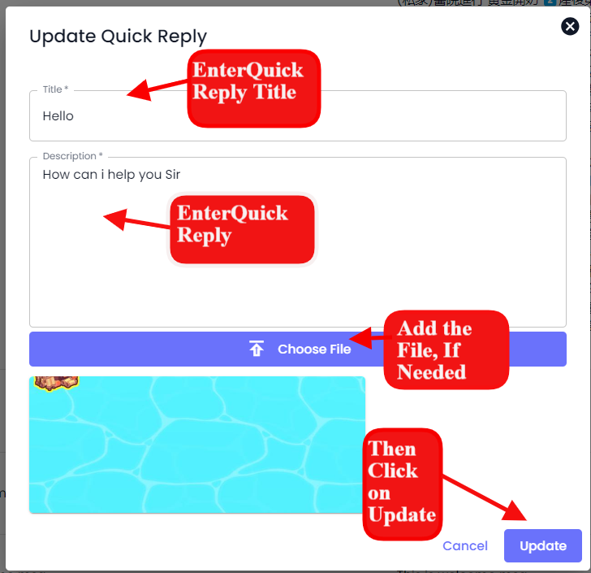
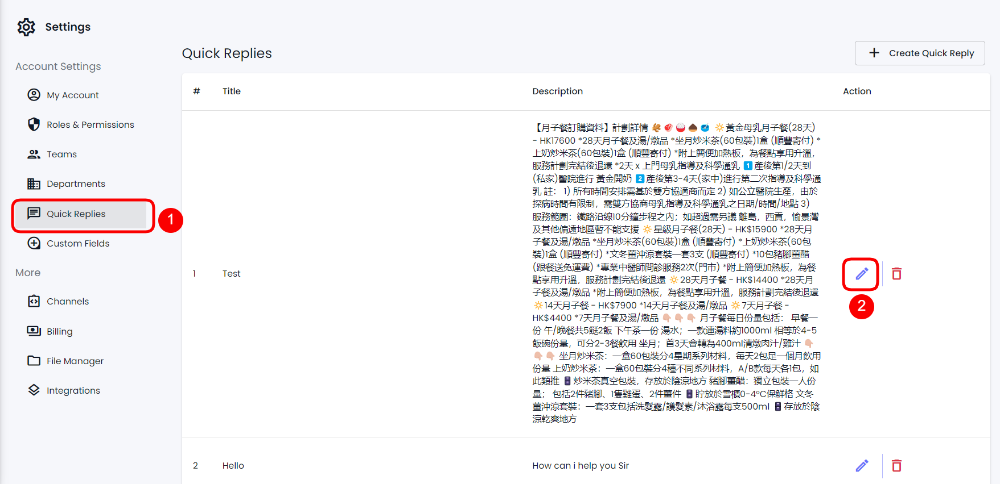

# Quick Reply

### Overview

Quick replies are helpful when you don't want to send the same message over and over manually to the same or different customers. At Chatobuy, you can create Quick Replies and send them using Chat to save time and respond to the user quickly.

<figure><figcaption></figcaption></figure>

To access Quick Reply, go to **Settings** → then click on the **Quick Reply** tab.

### Create a Quick Reply

<figure><figcaption></figcaption></figure>

To create a Quick Reply, click **Create Quick Reply**.

<figure><figcaption></figcaption></figure>

This will open the Quick Reply modal with fields to enter,

* Quick Reply Title - **Enter the title**
* Quick Reply - **Enter the description**
* And **Choose File** to attach an image file.

Simply input the details, add a file if you need it, and once done, click Update

### Edit a Quick Reply

<figure><figcaption></figcaption></figure>

To edit a Quick Reply, go to **Settings** → **Quick Reply** → then click the Edit icon.

<figure><figcaption></figcaption></figure>

This will open the Update Quick Reply modal. Here, you can make the changes as required to the selected Quick Reply. Once edited, click **Update**.

### Delete a Quick Reply

<figure><figcaption></figcaption></figure>

On the Quick Reply tab, click the Trash icon to delete a particular Quick Reply.

<figure><figcaption></figcaption></figure>

Then click **Confirm** to finalize deleting.

### Use

A Quick Reply could be used through Chat while conversing with a contact. Simply click the Plus iconand then select the **Quick Reply** button.

<figure><figcaption></figcaption></figure>

As you click the Quick Reply button, it will provide you with different quick replies to select.

<figure><figcaption>
Quick Replies
</figcaption></figure>

After selecting the Quick Reply, click the Send buttonor press Enter.

<figure><figcaption></figcaption></figure>


You can remove the file if not required by tapping the Cancel  button.

