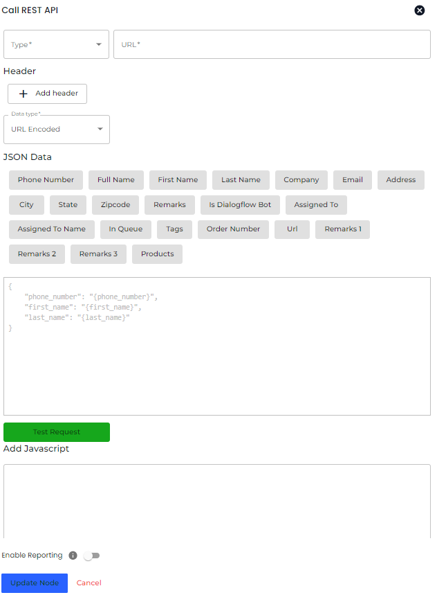

# Rest API

To integrate 3rd party platforms in Chatobuy, head over to the Integrations in the sidebar and then select **Rest API**.

<figure><figcaption></figcaption></figure>

The _RestAPI Integration_ modal will open, in that, according to your requirements and the platform's compatibility, add the REST API details. For instance,

* Type for URL as POST, GET, PUT and DELETE.
* Input Header Key(s) and Value(s).
* Select Data Type as URL Encoded, JSON or FORM.
* Then, add the JSON Data using the parameter fields and once done, click **Save**.
