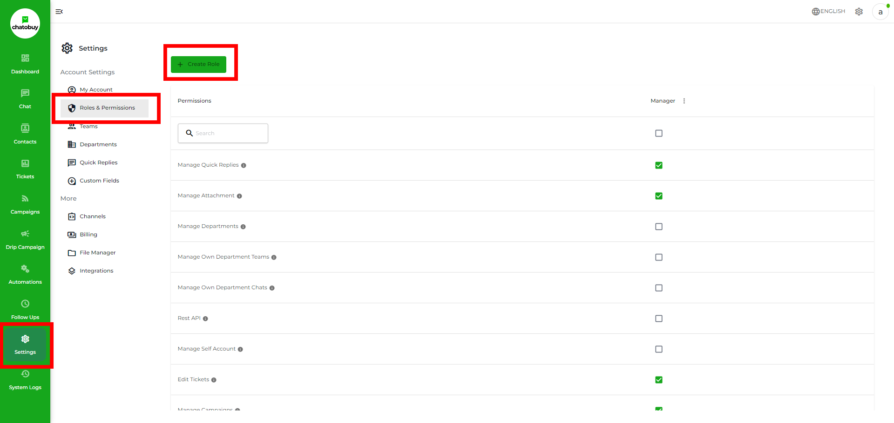
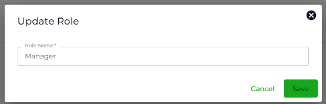

# Roles & Permissions

### Overview

Through **Roles & Permissions** Setting, you can create different roles and allow specific permissions to them. Then, use Roles to create [Team](https://github.com/rampwin/rampwin-gitbook-docs/blob/main/broken-reference/README.md) members and provide them control as per allowed permissions. This is useful to give team members limited control over the Chatobuy platform and its options.

To access this particular setting, go to **Settings** and then click **Roles & Permissions**.

<figure><figcaption></figcaption></figure>

### Create a Role

At Roles & Permissions, click the **Create Role** button.

Then, define the name of the Role and click **Save**.

### Assign Permission

Once you've created a Role, you'd find it in the tab. Then, to assign permissions, simply click the checkbox next to permission.

Or select them all by checking the Bulk box. There are a total of 34 permissions you can assign to a role.

| **1. Manage Quick Replies**           |
| ------------------------------------- |
| **2. Manage FAQ**                     |
| **3. Manage Attachment**              |
| **4. Manage Knowledge**               |
| **5. Manage Departments**             |
| **6. Rest API**                       |
| **7. Manage Self Account**            |
| **8. Edit Tickets**                   |
| **9. Manage Campaigns**               |
| **10. Manage Channels**               |
| **11. Manage Assigned Channels**      |
| **12. Manage Tickets**                |
| **13. Manage Custom Fields**          |
| **14. Manage Service Integrations**   |
| **15. Manage Settings**               |
| **16. Chat Customers**                |
| **17. Manage All Chats**              |
| **18. Manage All Tickets**            |
| **19. Manage Automation Rules**       |
| **20. Manage Recurring Events**       |
| **21. Manage Contacts**               |
| **22. Manage Follow Ups**             |
| **23. Manage All Follow Ups**         |
| **24. Can See Contact Basic Profile** |
| **25. Manage User Roles**             |
| **26. Manage Teams**                  |
| **27. Manage Message Template**       |
| **28. Manage Drip Campaign**          |
| **29. Manage Messages**               |
| **30. Manage Todo**                   |
| **31. Create Manual Payment Link**    |
| **32. Manage Chat Commerce Store**    |
| **33. Manage Notes**                  |
| **34. Delete Notes**                  |

### Editing a Role

To edit a Role, click the Menu (three vertical dots) icon, then select **Edit**.

It will allow you to change the name. Once edited, click **Save**.

<figure><figcaption></figcaption></figure>

### Delete a Role

To delete a Role, click the Menu (three vertical dots) icon, then select Delete.

Then click the **Confirm** button to finalise deleting.
