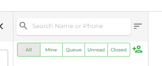

# Search Conversation

To search a conversation in chat, simply type your contact's phone number, name or message in the search field.

<figure><figcaption></figcaption></figure>

As you'll do that, it will bring the conversation matching the search query. You can also look for a particular message by switching to the Messages tab.

Furthermore, you can also sort conversations in the Latest or Oldest order.

Simply click theSorting button and then select either: **Latest First** or **Oldest First**.

### Chat Search Filters

If you want to narrow down the search, you can use the filter options. Simply click the filter button to access filter options.
