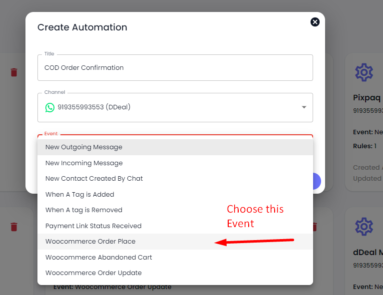
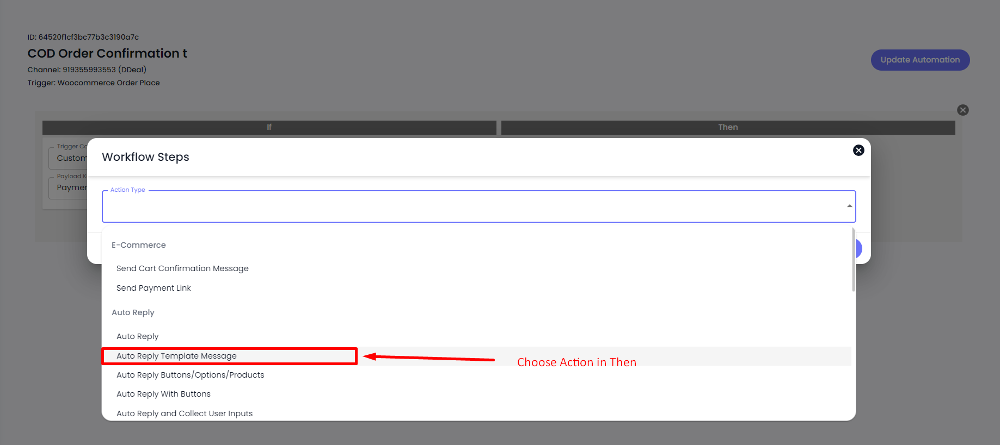
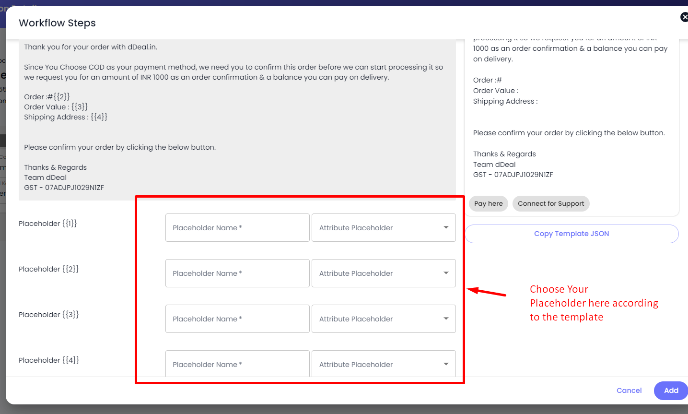
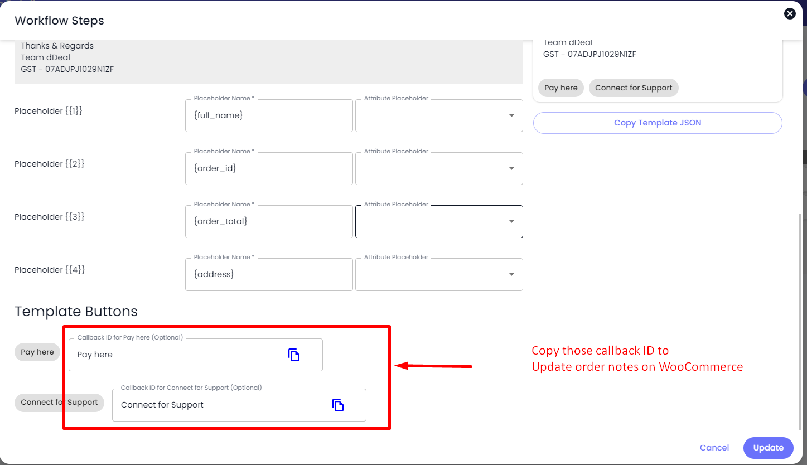

# Setup WooCoomerce Automations

* COD Order confirmation & Prepaid order notfication
* Track Order
* Abandoned Cart

#### How to setup COD Order Automation.

* Click on Automation.
* Click on Create Automation.
* Give a title, Select Channel & Choose WooCommerce Order Place Event.
* Click on Create.

<figure><figcaption>
COD Order Confirmation
</figcaption></figure>

<figure><figcaption>
Choose Custom Condition
</figcaption></figure>

* [ ] Choose Action Auto Reply Template Message.
* [ ] Choose your template for COD order confirmation.
* [ ] Choose your placeholders in Template message & Save.

<figure><figcaption></figcaption></figure>

<figure><figcaption></figcaption></figure>

<figure><figcaption></figcaption></figure>

If your template have buttons like Confirm COD Order, Cancel COD order, Connect with Agent then you have to create a separate automation for that.

User below steps to update order notes in your WooCommerce.

* Create a new automation.
* Give name, choose channel & select trigger New incoming message received.
* Click on Create automation button.
* Choose custom condition "List/Button Callback ID Matches" & paste your callback id in the value.
