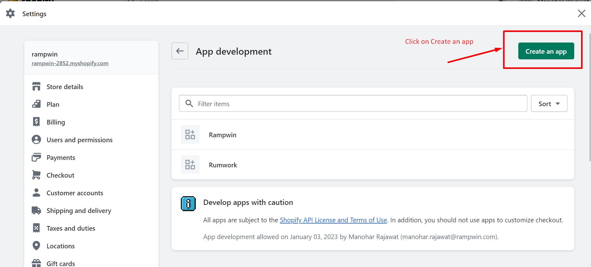
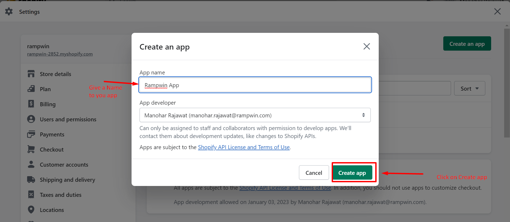
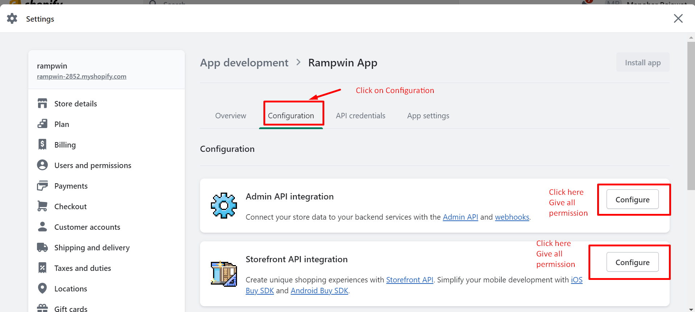
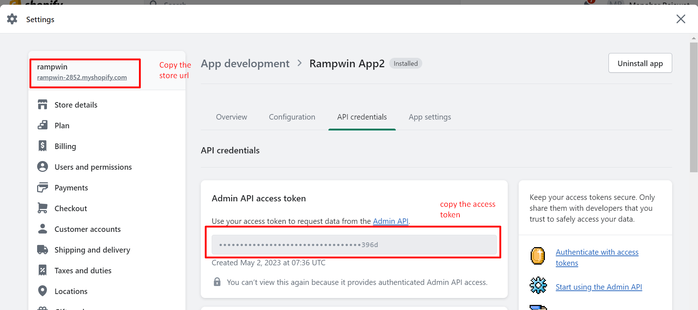
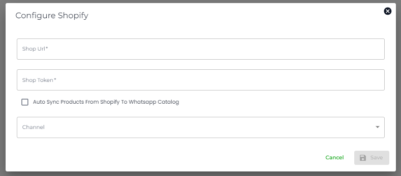

# Shopify Marketplace Setup

To setup your Shopify store in Chatobuy first you need to create a private app in your Shopify store here are the steps to create privet app on Shopify store.

* Login on your Shopify Admin
* Click on Apps
* Click on App and sales channel settings.
* Click on Develop App
* Click on Create an App.

<figure><figcaption>
App Create Screen
</figcaption></figure>

<figure><figcaption>
Develop App
</figcaption></figure>

<figure><figcaption>
Create an App
</figcaption></figure>

<figure><figcaption>
Create App Screen
</figcaption></figure>

After create an app you have to setup storefront & admin scope permission to use Chatobuy Whatsapp CRM.

<figure><figcaption>
Configuration Scopes
</figcaption></figure>

After Permission Install that APP.

Click on API credentials and Copy Access token & Store URL & paste it on the Shopify App Configuration Screen Popup.

<figure><figcaption></figcaption></figure>


Complete Video Guide to Setup Privet App


### Steps to Add Private App into Chatobuy

* Click on Integration from left hand side menu.
* Select Shopify from Marketplace Apps.
* Fill API key & store URL which you copy from Shopify App Credentials.
* Copy Chatobuy API key from [https://app.chatobuy.ai/settings](https://app.chatobuy.ai/settings).
* Copy Channel ID From Channel [https://app.chatobuy.ai/channels](https://app.chatobuy.ai/channels) .

<figure><figcaption>
Configure Shopify Popup
</figcaption></figure>


Click on checkbox if you wanted to sync your Shopify product on Facebook on hourly basis.

