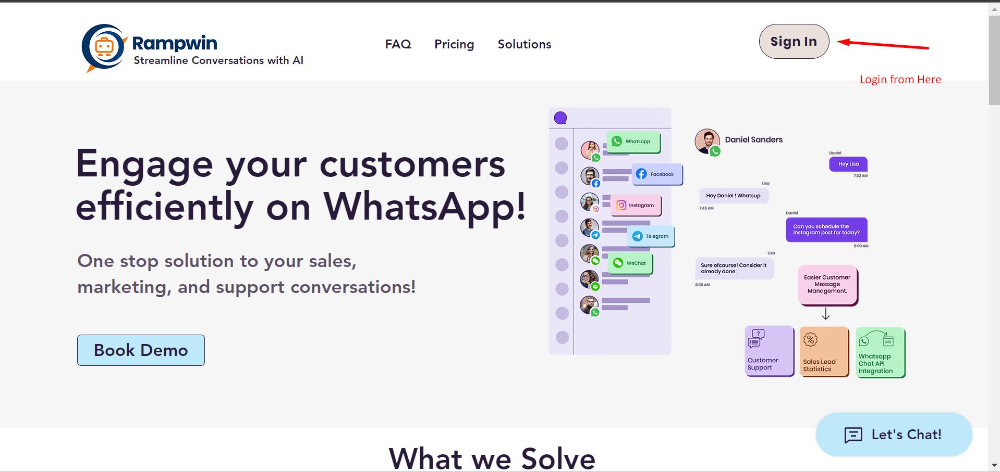
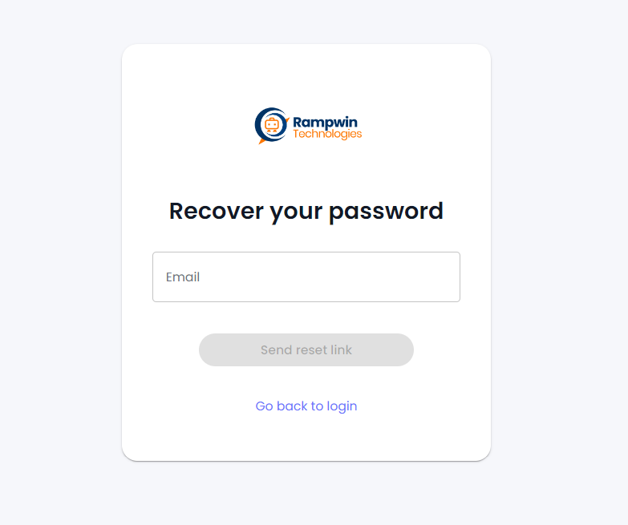

# Login to Chatobuy

To use the Chatobuyplatform, you need to log in, first. Therefore, open https://app.chatobuy.ai on your browser window.

<figure><figcaption>
Homepage
</figcaption></figure>

Or you can click the **Register/Login** button at rumwork.io. This will open the following login page.

<figure><figcaption>
Login Screen
</figcaption></figure>

### Register

If you haven't created an account before, click **Create an account**. This will open the following fields,

<figure><figcaption></figcaption></figure>

Simply enter the details and click **Register**.

<figure><figcaption></figcaption></figure>

It will send an email to confirm your details. Login to your email, then confirm the account. Once done, open the login window and use your details to log in.

<figure><figcaption></figcaption></figure>

Upon successful login, you'll find yourself on the [Chat screen](https://github.com/rampwin/rampwin-gitbook-docs/blob/main/starting-with-rampwin/broken-reference/README.md).

### Forgot Password

If you've forgotten your password, simply click **Forgot Password**.

Then, enter your email and click on the **Send reset link** button.

<figure><figcaption>
Reset Password
</figcaption></figure>

Open your email and follow the instructions to reset your password.

### Where to Start?

You can work at Chatobuy as you prefer the best. However, we suggest you start by creating and connecting the messaging channels, first.
