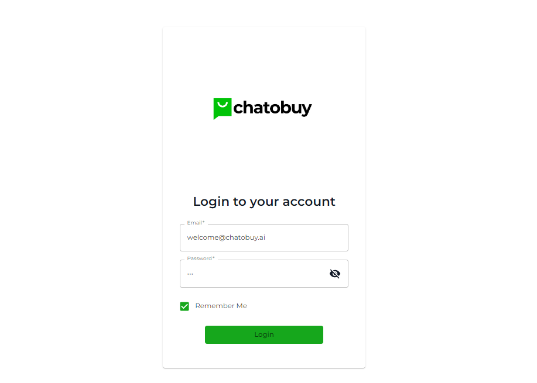

# Login to Chatobuy

To use the Chatobuy platform, you need to log in, first. Therefore, open [https://app.chatobuy.ai](https://app.chatobuy.ai) on your browser window.

<figure><figcaption>
Login Screen
</figcaption></figure>

Upon successful login, you'll find yourself on the Chat screen.

### Forgot Password

If you've forgotten your password, simply click **Forgot Password**.

Then, enter your email and click on the **Send reset link** button.

Open your email and follow the instructions to reset your password.

### Where to Start?

You can work at Chatobuy as you prefer the best. However, we suggest you start by creating and connecting the messaging channels, first.
