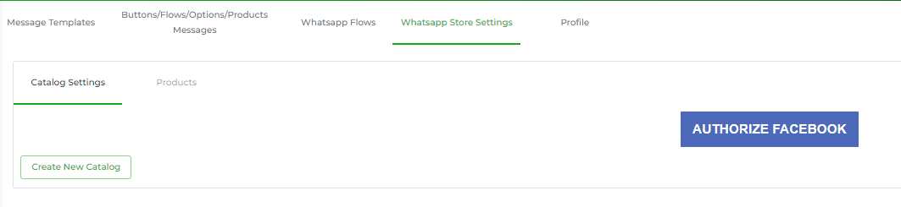
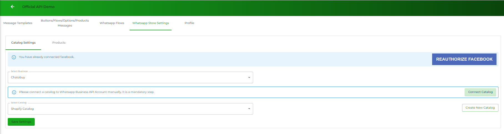

# Catalog Settings

### Authorisation

Using the Catalog Settings of a WhatsApp Channel, you can provide users or customers with product list available on the Facebook Store and enable them to purchase the products directly from WhatsApp chat.

In order to do so, you have to access the Catalog List, and the first step to do that is by authorising the Channel from Facebook. So, for that, click the **AUTHORIZE FACEBOOK** button.

<figure><figcaption></figcaption></figure>

A new mini tab will open; there, you've to log in to your Facebook Account.

Then, click **Continue** for the permission the Chatobuy platform requires.

### Select Business

As soon as you allow the permission, you'd see a new option in the Catalog Settings to Select a Business.

Here, select the Meta Business Account you've used to create the Channel and link it with Chatobuy. Once you select the business, a few more options appear:

<figure><figcaption></figcaption></figure>

* **Connect Catalog**
* **Create New Catalog**
* And the **Select Catalog**

### Connect Catalog

To access the Catalog on Facebook Store, it's necessary you connect it with the WhatsApp Channel. Therefore, click on the **Connect Catalog** button.

<figure><figcaption></figcaption></figure>

This will lead you to the [Facebook Catalog Linking](https://business.facebook.com/wa/manage/catalog-linking/) page. To connect the channel and access Catalog, click **Choose a Catalogue**.

<figure><figcaption></figcaption></figure>

Then, select a Catalog from the available list, and click **Connect Catalogue**.

<figure><figcaption></figcaption></figure>

Once you'll do that, you'd find the connected catalogue as the following.

<figure><figcaption></figcaption></figure>

### Select a Catalog

After connecting the catalog, what next you need to do is select the catalog in the Catalog Settings of Chatobuy. You can also create a new catalog by clicking **Create New Catalog** button. And once you've created the catalog, you need to follow the [previous step](catalog-settings.md#connect-catalog) to connect it with the Chatobuy Channel.

Then, you have to select it. And to do that, go **Select Catalog** → and select the catalog you've connected.

<figure><figcaption></figcaption></figure>

And after selecting the catalog, click **Save Settings**.

<figure><figcaption></figcaption></figure>

Once you save the settings, you can view your products in the Products tab.
