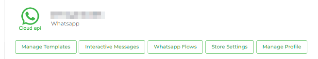

# WhatsApp

### Overview

WhatsApp Store Settings allows you to process orders and payments through Chatobuy. We provide support to WhatsApp using 4 Channels -

1. Unofficial
2. And [Cloud API](https://github.com/rampwin/rampwin-gitbook-docs/blob/main/store-settings-1/broken-reference/README.md)

### Open Store Settings

To open WhatsApp Store Settings for Cloud API, simply click the **Store Settings** for the respective channel in the Channels.

This will the WhatsApp Store Settings with the following options,

This will the WhatsApp Store Settings with the following options,

* **Catalog Settings** - Using this, you can access the products list (catalog) on Facebook. Or, create new lists of products (Catalogs.)
* **Products** -
* **Payment Settings** - Setup payment partners to process orders.

Explore the following doc pages to learn more about Store Settings' options.
