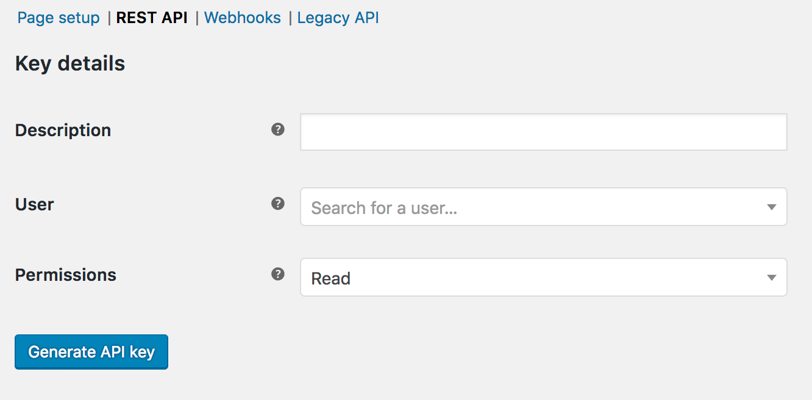

# WooCommerce Marketplace Setup

To setup your WooCommerce store in Chatobuy first you need to create a API Key in your WooCommerce Store steps below to Create API key.

To create an API key in WooCommerce, please follow the steps below:

1. Log in to your WooCommerce website with your administrator account.
2. Navigate to the "WooCommerce" menu in the WordPress dashboard and click on the "Settings" option.
3. In the "Settings" screen, select the "Advanced" tab and then click on the "REST API" option.
4. On the REST API screen, click on the "Add Key" button.
5. In the "Add Key" screen, enter a description for your API key in the "Description" field. This description will help you identify the key later.
6. Under the "Permissions" section, select the level of access that you want to give to this key. You can choose to give read-only access or full access.
7. Click on the "Generate API Key" button. This will generate a new API key for you.
8. Copy the Consumer Key and Consumer Secret and save them in a safe place. You will need these keys to add marketplace app in Chatobuy.

<figure><figcaption>
How to Add API Key
</figcaption></figure>

<figure><figcaption>
Generate API Key
</figcaption></figure>

<figure><figcaption>
API Key
</figcaption></figure>

### Steps to add WooCommerce API Key into Chatobuy&#x20;

* Click on Integration from left hand side menu.
* Select Woocommerce from Marketplace Apps.
* Fill consumer key, consumer secret & Store URL in the Popup & Save.

<figure><figcaption></figcaption></figure>

<figure><figcaption>
Configure WooCommerce
</figcaption></figure>

<figure><figcaption>
Configured App
</figcaption></figure>


When App configured you can Sync you Existing Contacts one time with Sync Contact Buttons.


When Your app is configured you can setup automation on Webhook Topics like below.
