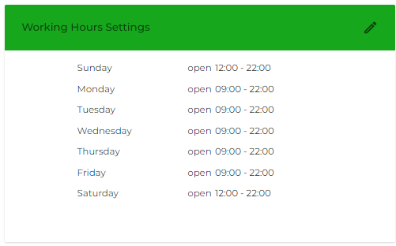

# Working Hours

To define the office hours and holidays of your business, you can utilize the Working Hours setting of [My Account](my-account.md).

<figure><figcaption></figcaption></figure>

Simply click the Edit icon.

Then, activate the days you work and mention the time.

If you want to declare holidays, click the Holidays field and then select the dates.

Once added Working Hours and Holidays, click **Apply**.
